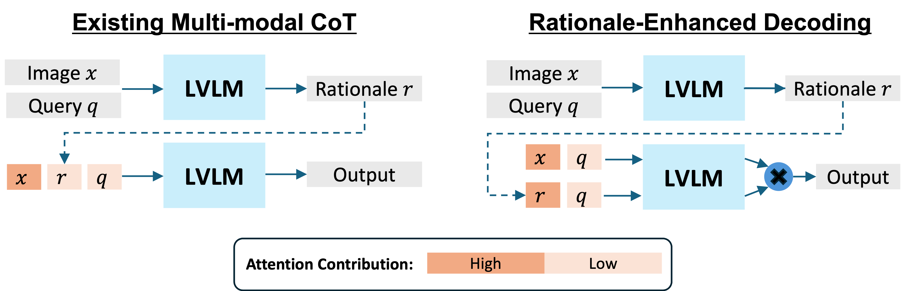

# [Rationale-Enhanced Decoding for Multi-modal Chain-of-Thought (CVPR2026)](https://arxiv.org/abs/2507.07685)


## Overview
Large vision-language models (LVLMs) have demonstrated remarkable capabilities by integrating pre-trained vision encoders with large language models (LLMs). Similar to single-modal LLMs, chain-of-thought (CoT) prompting has been adapted for LVLMs to enhance multi-modal reasoning by generating intermediate rationales based on visual and textual inputs. While CoT is assumed to improve grounding and accuracy in LVLMs, our experiments reveal a key challenge: existing LVLMs often ignore the contents of generated rationales in CoT reasoning. To address this, we re-formulate **multi-modal CoT reasoning as a KL-constrained reward maximization focused on rationale-conditional log-likelihood**. As the optimal solution, we propose **rationale-enhanced decoding (RED)**, a novel plug-and-play inference-time decoding strategy. RED harmonizes visual and rationale information by multiplying distinct image-conditional and rationale-conditional next token distributions. This code repository privides a minimal Python implementation of RED and experimental evaluations with GQA.


## Requirements
### Middleware Requirements
- CUDA >= 12.3
### Python Requirements
- Run `pip install -r requirements.txt`

## Preparations
### Evaluation Dataset: GQA
- 1. Download input images from [here](https://downloads.cs.stanford.edu/nlp/data/gqa/images.zip)
- 2. Extract and place images in `data/gqa/images`

## Example on Qwen3VL-8B
**[2026/4/1]** We observed a significant performance degradation of Qwen2.5-VL-7B in the latest transformer version for some reasons. Please try to use Qwen3-VL-8B instead of Qwen2.5-VL-7B for demonstration.

```bash
bash experiments/01_benchmarks/qwen3-vl-8b/gqa/red.sh
```

## Citation

```bibtex
@inproceedings{Yamaguchi_CVPR26_RED,
  title={Rationale-Enhanced Decoding for Multi-modal Chain-of-Thought},
  author={Yamaguchi, Shin'ya and Nishida, Kosuke and Chijiwa, Daiki},
  booktitle={Proceedings of the IEEE/CVF Conference on Computer Vision and Pattern Recognition},
  year={2026}
}
```
